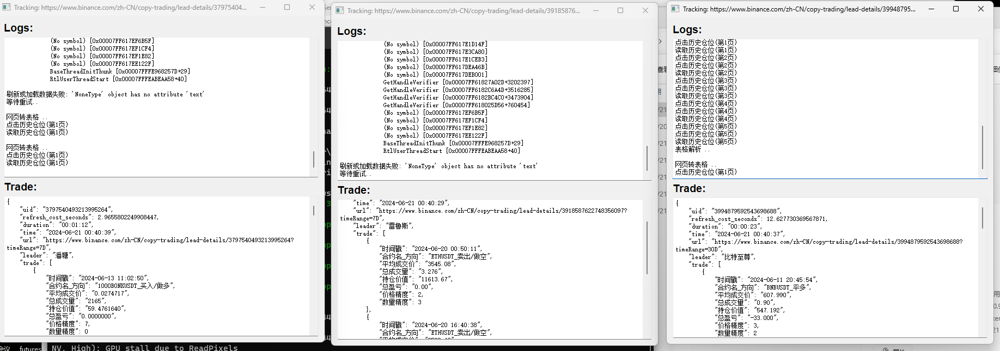
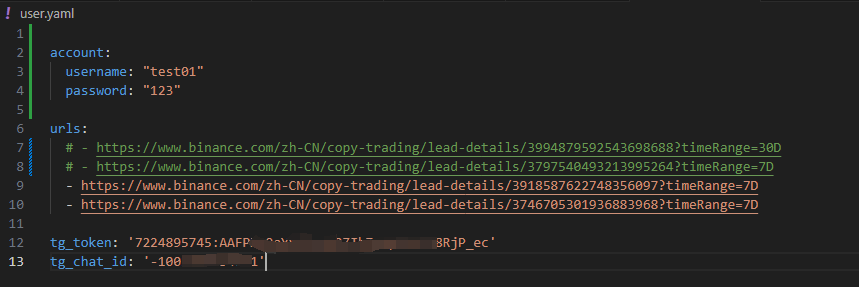
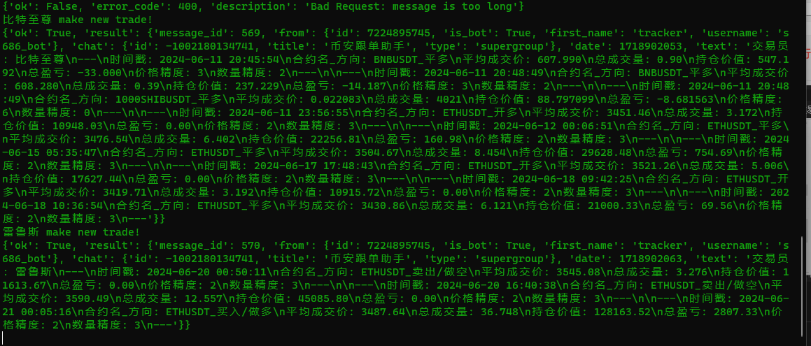
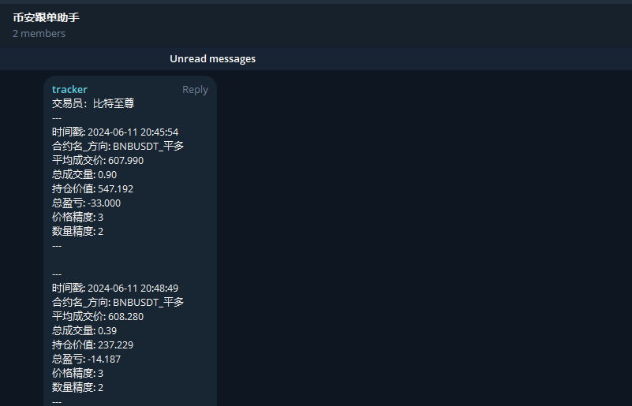
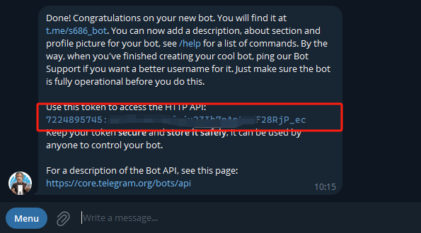

# Tracker - Binance Public Copy Trading Signal Tracker

Tracker software will track the historical trades of Binance public copy trading in real-time and organize position signals. It supports both **GUI/Command Line** operation on Windows/Linux systems and real-time position change notifications via Telegram. Currently, Tracker only supports trading signal acquisition, and real-time sync copy trading with MAKER is still under development.

---

Here is a free public test account:
> Username: test01  
> Password: 123

To open a private account, click here: [http://www.funsound.cn:5010/](http://www.funsound.cn:5010/) ; Like our GitHub page and join the group to get access.

Download link: [https://github.com/lazyer-trading/BN_Tracker/releases](https://github.com/lazyer-trading/BN_Tracker/releases)

# User Guide
## GUI Interaction
> The login interface is as follows:


> After filling in the details, click on Track to generate a sub-window for monitoring. You can track multiple traders.


## Command Line Interaction
This method is suitable for long-term background monitoring and is relatively stable.
> ```bash
> ./main.exe user.yaml
> ```

yaml 格式
```python
account:
  username: "test01"
  password: "123" 

urls:
  - https://www.binance.com/zh-CN/copy-trading/lead-details/3994879592543698688?timeRange=30D
  - https://www.binance.com/zh-CN/copy-trading/lead-details/3797540493213995264?timeRange=7D
  - https://www.binance.com/zh-CN/copy-trading/lead-details/3918587622748356097?timeRange=7D
  - https://www.binance.com/zh-CN/copy-trading/lead-details/3746705301936883968?timeRange=7D

tg_token: ''
tg_chat_id: ''
```

> The `user.yaml` file contains the trader's homepage and Telegram API details.


> After running, your Telegram channel will receive position change information.


# Telegram Notifications


## Telegram API
> Token: Obtained by creating a new bot.
> 


> Chat ID: Login to the web version, select your personal channel, and find the ID in the URL starting with `-`.
> 


# Contact Us
#### Telegram: [@lazyer_trading](https://t.me/bn_ct_track)
#### Email: [lazyer.trading@gmail.com](mailto:lazyer.trading@gmail.com)

