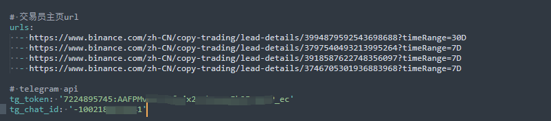

# 追客（tracker）币安公域跟单信号追踪

追客软件将实时跟踪币安公域跟单的历史交易进行仓位信号整理，支持【图形界面/命令行】运行，支持windows/linux系统，支持实时仓位变动信息telegram转发。目前追客只支持交易信号获取，实时同步跟单交易 魅客(MAKER)还在开发中。

---

以下是免费公测账号：
> 账号：test01  
> 密码：123

私人账号开通请点击这：http://www.funsound.cn:5010/ ; github点赞进群获取权限

下载地址：https://github.com/lazyer-trading/BN_Tracker/releases

#  使用教程
## 界面交互
> 登陆界面如下

>填线完毕后，点击追踪会生成一个子窗口进行监视，支持追踪多位交易员

## 命令行交互
这个适合长期后台检测，比较稳定
> ./main.exe user.yaml

> 其中user.yaml文件包含交易员主页和telegram api

> 跑起来后你的telegram频道会收到仓位变动信息

# Telegram 通知

## Telegram api
> token 获取通过新建机器人

> 新建频道获取其id（登陆网页版，在网址里 -开头）

# 联系我们
#### telegram: [@lazyer_trading](https://t.me/bn_ct_track)
#### email: lazyer.trading@gmail.com