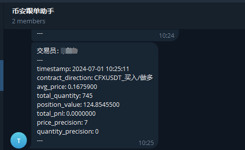
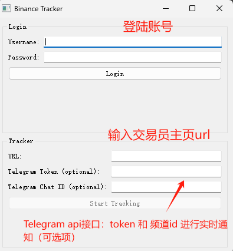
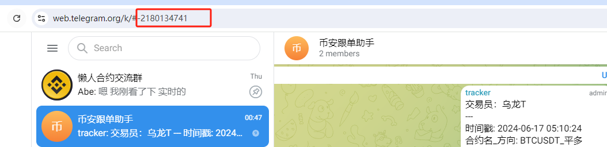

# 币安跟单助手（Tracker）

币安跟单助手Tracker模块 提供追踪公域带单信号，追踪交易记录，生成实时仓位表单，通过Telegram实时通知。目前支持：
 - windows / linux 两种版本，支持后台长期监控
 - windows 提供命令行/图形交互，linux仅限命令行，支持同时追踪多位交易员线程。
 - 不开源但是免费，欢迎加入电报群交流

<p align="left">
     &nbsp 
     &nbsp
    
</p>


---
### 软件下载
下载链接: [https://github.com/lazyer-trading/BN_Tracker/releases](https://github.com/lazyer-trading/BN_Tracker/releases)

> ubuntu 首次使用chrome遇到异常请尝试： </br>
> wget https://dl.google.com/linux/direct/google-chrome-stable_current_amd64.deb </br>
> sudo apt install ./google-chrome-stable_current_amd64.deb </br>
> sudo apt-get -f install </br>

账号注册链接：https://www.funsound.cn/tracker


## 使用教程

### 图形交互
> 1.登陆账号 </br>
> 2.输入交易员主页url 例如：https://www.binance.com/zh-CN/copy-trading/lead-details/3994879592543698688?timeRange=30D </br>
> 3. 如果希望telegram通知，输入telegram的api
<p align="center">

</br>
点击追踪后，跳出一个子窗口用于检测目标交易员交易信号，可生成多个窗口
</br>

</p>


## 命令行交互
命令行交互适合后台长期运行，例如nohup命令，使用如下，传入配置即可
> ```bash
> ./main.exe user.yaml
> ```

其中 yaml 格式 如下
```python
account:
  username: "test01"
  password: "123" 

urls:
  - https://www.binance.com/zh-CN/copy-trading/lead-details/3994879592543698688?timeRange=30D
  - https://www.binance.com/zh-CN/copy-trading/lead-details/3797540493213995264?timeRange=7D
  - https://www.binance.com/zh-CN/copy-trading/lead-details/3918587622748356097?timeRange=7D
  - https://www.binance.com/zh-CN/copy-trading/lead-details/3746705301936883968?timeRange=7D

tg_token: ''
tg_chat_id: ''
```
运行时界面：
> After running, your Telegram channel will receive position change information.
<p align="center">

</p>


## 获取 Telegram API
> Token: 新建一个机器人即可获取
<p align="center">

</p>

> Chat ID: 新建机器人后，创建一个频道，将机器人设置为管理员就可以就收消息了，频道id通过网页端可以获取，“-”开头后数字.
> 
<p align="center">

</p>


# 联系我们
#### Telegram: [@lazyer_trading](https://t.me/bn_ct_track)
#### Email: [lazyer.trading@gmail.com](mailto:lazyer.trading@gmail.com)

